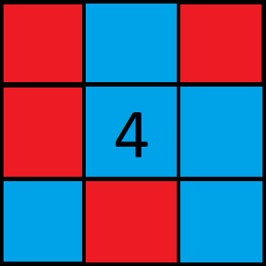

# MazeSweeper

## What is this?

MazeSweeper is a game heavily inspired by MineSweeper, except that you don't have to solve the board completely.

Instead, you need to determine the shortest distance of the path(s) from the start to the end. The aim is to determine as many shortest distances from the boards correctly under a set time. You also cannot click on a square that is not a empty path - think of it like a maze where the walls are pitfalls.

## Game Modes

1.  You have the choice of playing from the following options:
    - "_QuickMode_" - 2:30 mins
    - "Normal" - 10 mins
    - "Chill and Casual" - no time limit, but see how many consecutive correct answers you can get in a row.
2.  The board provided will be like a MineSweeper grid, but with a distinct start and end. The number in the centre is the number of adjacent empty paths. There are different sizes:
    - 10x10
    - 16x16
    - 16x30

## Rules

1.  A path is defined to be any direct consecutive sequence of empty path squares between the start and end.
    - 2 path squares are in a sequence if one is in the perimeter of the other - i.e., if the green square was your current, any other path square in its 8 sq. perimeter is valid as a addition to sequence starting green.
    - A square will have a number in it, referring to the number of path squares adjacent to the current

  

2.  You need to find the shortest path (measured in number of squares) from start to end, and type this value into the input box. If there is no valid path, type 0.
3.  Points are awarded based on the difficulty & speed of answers you give. See below for more on points.
4.  Error amounts - in different game modes, you are allowed a certain error boundary around the true answer in which answers will still accepted.
    - "_QuickMode_" has error boundary of (+1,-1)
    - "Normal" has error boundary of (+2,-2)
    - "Chill and Casual" has error boundary (+3,-3)

---

## Points

Points allocated for solving a board is dependent of difficulty/size of board:

- 10x10 gives 5 points per solve
- 16x16 gives 10 points per solve
- 16x30 gives 15 points per solve

Each reward comes with modifiers which adjusts the points rewarded based on speed:

- Speed
  - If less than 30s per solve -> +5 points
  - If less than 1 min per solve -> +3 points
  - Otherwise, +1 point

### Deductions

In game modes like "_QuickMode_" and "Normal", if your answer is incorrect/not in error boundary, your score gets deducted by an amount based on the distance between your answer and the original, as well as the difficulty:

\*An underscore means "any mode or any distance"

\**Only 1 deduction is selected
| Points | Mode | Distance |
|--------|--------------|----------|
| -5 | *QuickMode\* | \_ |
| -2 | Normal | 3 |
| -5 | Normal | <= 5 |
| -7 | Normal | <= 7 |
| -10 | Normal | > 7 |

---

## How this is hosted

This repo is hosted using GitHub Pages, and uses React.js (via CRA), Redux.
Unit tests done by Jest
